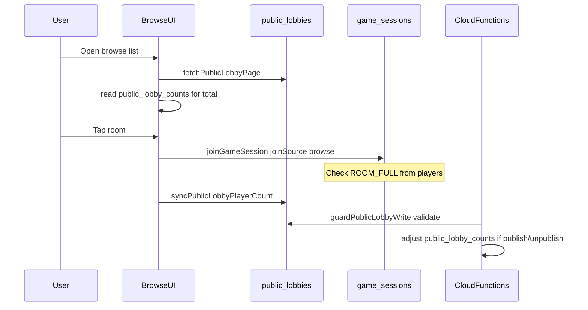

# Firebase Realtime Database schema (Wordreapers)

Online multiplayer uses RTDB under the paths below. Types live in [`lib/firebase/types.ts`](../lib/firebase/types.ts).

## `game_sessions/{gameId}`

Core session document for a room.

| Field                                                                            | Description                                                                                                                                          |
| -------------------------------------------------------------------------------- | ---------------------------------------------------------------------------------------------------------------------------------------------------- |
| `status`                                                                         | `waiting` \| `playing` \| `finished`                                                                                                                 |
| `organizerId`                                                                    | Firebase uid of room creator                                                                                                                         |
| `baseWord`                                                                       | Current round base word                                                                                                                              |
| `settings`                                                                       | Duration, lexicon flags, `language` (e.g. `uk-uk`)                                                                                                   |
| `players/{uid}`                                                                  | Roster: name, scores, `online` (foreground presence — AppState active / connected), `hasLeft` (voluntary leave), `publicAlias`, `joinedVia`          |
| `liveRoundPlayerUids`                                                            | Uids opted into the current live `playing` round (round 2+); set at `waiting → playing` from lobby `online: true`, appended on mid-round join/rejoin |
| `resultsExitedBy/{uid}`                                                          | Opt-in marker from «Грати ще» before rematch; cleared at round start                                                                                 |
| `baseWordRound`                                                                  | Round index (0 = first round); increments on rematch                                                                                                 |
| `baseWordPickerOrder`, `baseWordPickerUid`, `baseWordChosenBy`                   | Base-word picker rotation                                                                                                                            |
| `timerEndsAt`, `roundStartedAt`, `roundTimerBudgetSeconds`, `roundPlayedSeconds` | Round timer                                                                                                                                          |
| `earlyFinishVote`, `pauseVote`, `addTimeVote`, `resumeVote`, `pauseState`        | In-round votes (see `online-multiplayer-rules.md`)                                                                                                   |
| `finishedAt`, `purgeAfterAt`                                                     | Finished session metadata / TTL purge                                                                                                                |
| `createdAt`                                                                      | Room lifecycle clock (set on create; refreshed on rematch). Abandoned waiting/playing TTL                                                            |
| `isPublic`                                                                       | Room listed in public browse while waiting                                                                                                           |
| `publicPublishedAt`                                                              | Server ms when published to browse                                                                                                                   |
| `identityMasked`                                                                 | Permanent after a browse-list join; pseudonyms for strangers                                                                                         |
| `maxPlayers`                                                                     | Cap for public rooms (8)                                                                                                                             |

**Join (browse or invite):** clients write `players/{uid}` on `game_sessions`. `ROOM_FULL` is computed from active roster (`hasLeft !== true`), not from browse index counters.

**RTDB read policy (Phase 1 security):**

- **Roster members** — full read on `game_sessions/{gameId}` for any `status`.
- **Non-members** — read only when `status === 'waiting'` (browse / lobby peek).
- **Invite into `playing` room** — no pre-read; client uses blind join (`players/{self}` + session metadata patch), then reads as roster. RTDB `settings` are not writable while `status === 'playing'`, except auto x2 latch (`uniqueBonusEnabled: false → true`) and **`waiting → playing` round start** (recalc `uniqueBonusEnabled` from opt-in roster size; other settings fields unchanged). Clients derive display x2 from `uniqueBonusMode` + live-round roster size when rules block writes.

`players/{uid}.joinedVia`:

- `browse` — joined from public matchmaking list
- `invite` — room code / QR

## `public_lobbies/{language}/{gameId}`

Denormalized **browse index** (one row per public waiting room).

| Field                       | Description                                 |
| --------------------------- | ------------------------------------------- |
| `baseWord` / `baseWordNorm` | Display + sort key (normalized Ukrainian)   |
| `playerCount`               | Active roster size (mirror of session)      |
| `maxPlayers`                | Always 8 for public rooms                   |
| `publishedAt`               | Sort key (newest first)                     |
| `expiresAt`                 | `publishedAt + PUBLIC_LOBBY_TTL_MS` (5 min) |

**Who writes:**

- **Organizer** — create full index row on publish (`set`); session must have `isPublic === true`
- **Any roster player** — update `playerCount` only after join/leave (other index fields unchanged)
- **Organizer or roster player** — delete row on unpublish (`remove`)

**Cloud Function `guardPublicLobbyWrite`** validates every write against `base_words.uk-uk.txt` allowlist and requires `baseWordNorm === normalizeUk(baseWord)`; rejects invalid rows.

TTL display in the app uses Firebase server clock (`getServerNow` / `useServerNow`).

## `public_lobby_counts/{language}`

Single number: **how many public waiting rooms** exist for a language (not player count).

- **Clients:** read-only (RTDB rule `.write: false`)
- **Maintained by Cloud Functions:**
  - `guardPublicLobbyWrite` — `+1` on new valid index row, `-1` on delete or invalid→removed
  - `purgeStalePublicLobbiesScheduled` — removes stale rows and **reconciles** count from live shard scan every 15 minutes

Browse pagination reads this node for `total` / page count; falls back to a full shard scan if the counter is missing or corrupt.

## Browse → join flow

## Related paths

- `session_word_maps/{gameId}` — shared word overlap maps during play
  - Writes are **per-word shards** only: `wordPlayers/{normalized}/{uid}` (no bulk root JSON from clients).
  - Overlap uniqueness and live x2 demotion use `wordPlayers` counts/peers (no separate first-submitter map).
- `player_words/{gameId}/{uid}` — per-player submitted words (immutable per normalized key)

## Security (RTDB rules + App Check)

- Rules: [`firebase/database.rules.json`](../firebase/database.rules.json) — roster-scoped writes, score caps, status transitions, waiting-only peek for strangers. **`waiting → playing`:** actor must match `newData.parent().baseWordPickerUid` (same atomic update) or stored `baseWordPickerUid`, or rotation fallback via `baseWordPickerOrder[baseWordRound]`. **Rematch** (`finished` → `waiting`): any roster member may commit the reset transaction (clears scores, reopens lobby); rules allow roster-wide player reset only in that transition.
- **App Check:** native attestation via `@react-native-firebase/app-check` (Play Integrity / App Attest in production; debug token in dev). Tokens are **bridged into the JS SDK** (`firebase/app-check` `CustomProvider`) so `firebase/database` and `firebase/auth` attach `X-Firebase-AppCheck` on every request — see [`lib/firebase/app-check.ts`](../lib/firebase/app-check.ts). Enable RTDB enforcement in Console only after store builds show **Verified** metrics (not 100% outdated client).
- **Room codes:** exactly **5 characters** (`lib/firebase/room-code.ts`).
- **Rules tests:** `npm run test:rules` (Firebase emulator + Vitest).

## Cloud Functions (RTDB)

| Function                            | Schedule / trigger                            | Role                                                                                           |
| ----------------------------------- | --------------------------------------------- | ---------------------------------------------------------------------------------------------- |
| `guardPublicLobbyWrite`             | on write `public_lobbies/{language}/{gameId}` | Content safety + counter delta                                                                 |
| `purgeStalePublicLobbiesScheduled`  | every 15 minutes                              | Drop expired/stale index rows; reconcile counts                                                |
| `purgeExpiredRtdbSessionsScheduled` | every 24 hours                                | Purge finished (`purgeAfterAt`) and abandoned waiting/playing (`createdAt` / `roundStartedAt`) |

One-shot orphan wipe (manual, after deploy): `npm run firebase:purge-orphans` (`scripts/purge-orphan-sessions.mjs`; loads `.env` / `.env.local`; supports `DRY_RUN=1`).

Deploy order when changing backend: **functions first**, then **database rules**, then **client**. App Check enforcement in Console **after** release builds include the SDK.
