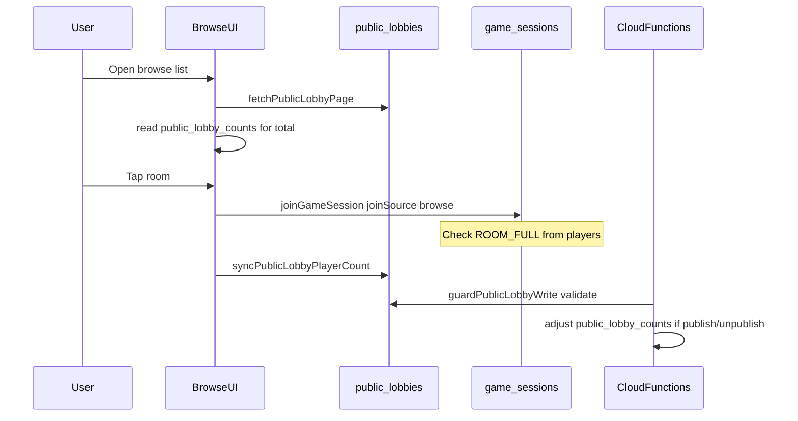

# Firebase Realtime Database schema (Wordreapers)

Online multiplayer uses RTDB under the paths below. Types live in [`lib/firebase/types.ts`](../lib/firebase/types.ts).

## `game_sessions/{gameId}`

Core session document for a room.

| Field               | Description                                                           |
| ------------------- | --------------------------------------------------------------------- |
| `status`            | `waiting` \| `playing` \| `finished`                                  |
| `organizerId`       | Firebase uid of room creator                                          |
| `baseWord`          | Current round base word                                               |
| `settings`          | Duration, lexicon flags, `language` (e.g. `uk-uk`)                    |
| `players/{uid}`     | Roster: name, scores, `online`, `hasLeft`, `publicAlias`, `joinedVia` |
| `isPublic`          | Room listed in public browse while waiting                            |
| `publicPublishedAt` | Server ms when published to browse                                    |
| `identityMasked`    | Permanent after a browse-list join; pseudonyms for strangers          |
| `maxPlayers`        | Cap for public rooms (8)                                              |

**Join (browse or invite):** clients write `players/{uid}` on `game_sessions`. `ROOM_FULL` is computed from active roster (`hasLeft !== true`), not from browse index counters.

`players/{uid}.joinedVia`:

- `browse` — joined from public matchmaking list
- `invite` — room code / QR

## `public_lobbies/{language}/{gameId}`

Denormalized **browse index** (one row per public waiting room).

| Field                       | Description                                 |
| --------------------------- | ------------------------------------------- |
| `baseWord` / `baseWordNorm` | Display + sort key (normalized Ukrainian)   |
| `playerCount`               | Active roster size (mirror of session)      |
| `maxPlayers`                | Always 8 for public rooms                   |
| `publishedAt`               | Sort key (newest first)                     |
| `expiresAt`                 | `publishedAt + PUBLIC_LOBBY_TTL_MS` (5 min) |

**Who writes:**

- **Organizer** — create full index row on publish (`set`); session must have `isPublic === true`
- **Any roster player** — update `playerCount` only after join/leave (other index fields unchanged)
- **Organizer or roster player** — delete row on unpublish (`remove`)

**Cloud Function `guardPublicLobbyWrite`** validates every write against `base_words.uk-uk.txt` allowlist and requires `baseWordNorm === normalizeUk(baseWord)`; rejects invalid rows.

TTL display in the app uses Firebase server clock (`getServerNow` / `useServerNow`).

## `public_lobby_counts/{language}`

Single number: **how many public waiting rooms** exist for a language (not player count).

- **Clients:** read-only (RTDB rule `.write: false`)
- **Maintained by Cloud Functions:**
  - `guardPublicLobbyWrite` — `+1` on new valid index row, `-1` on delete or invalid→removed
  - `purgeStalePublicLobbiesScheduled` — removes stale rows and **reconciles** count from live shard scan every 15 minutes

Browse pagination reads this node for `total` / page count; falls back to a full shard scan if the counter is missing or corrupt.

## Browse → join flow

## Related paths

- `session_word_maps/{gameId}` — shared word overlap maps during play
- `player_words/{gameId}/{uid}` — per-player submitted words

## Cloud Functions (RTDB)

| Function                            | Schedule / trigger                            | Role                                            |
| ----------------------------------- | --------------------------------------------- | ----------------------------------------------- |
| `guardPublicLobbyWrite`             | on write `public_lobbies/{language}/{gameId}` | Content safety + counter delta                  |
| `purgeStalePublicLobbiesScheduled`  | every 15 minutes                              | Drop expired/stale index rows; reconcile counts |
| `purgeExpiredRtdbSessionsScheduled` | every 24 hours                                | Purge old finished sessions                     |

Deploy order when changing counter rules: **functions first**, then **database rules**, then **client** (client no longer writes counts).
