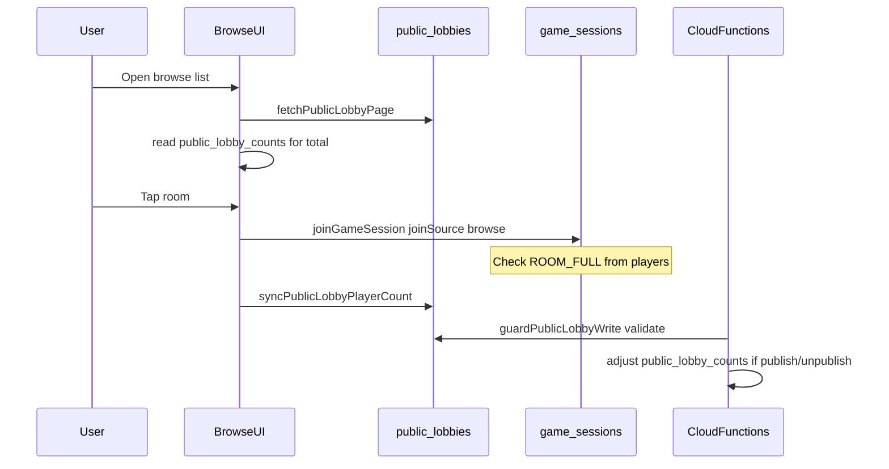

# Firebase Realtime Database schema (Wordreapers)

Online multiplayer uses RTDB under the paths below. Types live in [`lib/firebase/types.ts`](../lib/firebase/types.ts).

## `game_sessions/{gameId}`

Core session document for a room.

| Field                                                                            | Description                                                                                                                                          |
| -------------------------------------------------------------------------------- | ---------------------------------------------------------------------------------------------------------------------------------------------------- |
| `status`                                                                         | `waiting` \| `playing` \| `finished`                                                                                                                 |
| `organizerId`                                                                    | Firebase uid of room creator                                                                                                                         |
| `baseWord`                                                                       | Normalized base word (apostrophes stripped) — identity for lexicon / validation                                                                      |
| `baseWordDisplay`                                                                | Surface form for lobby / keyboard / results (alongside normalized `baseWord`; word lists use lexicon displays)                                       |
| `settings`                                                                       | Duration, lexicon flags, `language` (e.g. `uk-uk`)                                                                                                   |
| `players/{uid}`                                                                  | Roster: name, scores, `online` (foreground presence — AppState active / connected), `hasLeft` (voluntary leave), `publicAlias`, `joinedVia`          |
| `liveRoundPlayerUids`                                                            | Uids opted into the current live `playing` round (round 2+); set at `waiting → playing` from lobby `online: true`, appended on mid-round join/rejoin |
| `resultsExitedBy/{uid}`                                                          | Opt-in from «Грати ще»; kept as rematch-waiting latch after `finished → waiting`; cleared at round start                                             |
| `baseWordRound`                                                                  | Round index (0 = first round); increments on rematch                                                                                                 |
| `baseWordPickerOrder`, `baseWordPickerUid`, `baseWordChosenBy`                   | Base-word picker rotation                                                                                                                            |
| `timerEndsAt`, `roundStartedAt`, `roundTimerBudgetSeconds`, `roundPlayedSeconds` | Round timer                                                                                                                                          |
| `earlyFinishVote`, `pauseVote`, `addTimeVote`, `resumeVote`, `pauseState`        | In-round votes (see `online-multiplayer-rules.md`)                                                                                                   |
| `finishedAt`, `purgeAfterAt`                                                     | Finished session metadata / TTL purge                                                                                                                |
| `createdAt`                                                                      | Room lifecycle clock (set on create; refreshed on rematch). Abandoned waiting/playing TTL                                                            |
| `isPublic`                                                                       | Room listed in public browse while waiting                                                                                                           |
| `publicPublishedAt`                                                              | Server ms when published to browse                                                                                                                   |
| `identityMasked`                                                                 | Permanent after a browse-list join; pseudonyms for strangers                                                                                         |
| `maxPlayers`                                                                     | Cap for public rooms (8)                                                                                                                             |

**Join (browse or invite):** clients write `players/{uid}` on `game_sessions`. `ROOM_FULL` is computed from active roster (`hasLeft !== true`), not from browse index counters.

**RTDB read policy (Phase 1 security):**

- **Roster members** — full read on `game_sessions/{gameId}` for any `status`.
- **Non-members** — read only when `status === 'waiting'` (browse / lobby peek).
- **Invite into `playing` room** — no pre-read; client uses blind join (`players/{self}` + session metadata patch), then reads as roster. RTDB `settings` are not writable while `status === 'playing'`, except auto x2 latch (`uniqueBonusEnabled: false → true`) and **`waiting → playing` round start** (recalc `uniqueBonusEnabled` from opt-in roster size; other settings fields unchanged). Clients derive display x2 from `uniqueBonusMode` + live-round roster size when rules block writes.

`players/{uid}.joinedVia`:

- `browse` — joined from public matchmaking list
- `invite` — room code / QR

## `public_lobbies/{language}/{gameId}`

Denormalized **browse index** (one row per public waiting room).

| Field                       | Description                                 |
| --------------------------- | ------------------------------------------- |
| `baseWord` / `baseWordNorm` | Display + sort key (normalized Ukrainian)   |
| `playerCount`               | Active roster size (mirror of session)      |
| `maxPlayers`                | Always 8 for public rooms                   |
| `publishedAt`               | Sort key (newest first)                     |
| `expiresAt`                 | `publishedAt + PUBLIC_LOBBY_TTL_MS` (5 min) |

**Who writes:**

- **Organizer** — create full index row on publish (`set`); session must have `isPublic === true`
- **Any roster player** — update `playerCount` only after join/leave (other index fields unchanged)
- **Organizer or roster player** — delete row on unpublish (`remove`)

**Cloud Function `guardPublicLobbyWrite`** validates every write against `base_words.uk-uk.txt` allowlist and requires `baseWordNorm === normalizeUk(baseWord)`; rejects invalid rows.

TTL display in the app uses Firebase server clock (`getServerNow` / `useServerNow`).

## `public_lobby_counts/{language}`

Single number: **how many public waiting rooms** exist for a language (not player count).

- **Clients:** read-only (RTDB rule `.write: false`)
- **Maintained by Cloud Functions:**
  - `guardPublicLobbyWrite` — `+1` on new valid index row, `-1` on delete or invalid→removed
  - `purgeStalePublicLobbiesScheduled` — removes stale rows, clears `game_sessions.isPublic` / `publicPublishedAt` for purged rooms, and **reconciles** count from live shard scan every 15 minutes

Browse pagination reads this node for `total` / page count; falls back to a full shard scan if the counter is missing or corrupt. If the first browse page is shorter than the counter (expired ghost rows filtered client-side), the client **recounts** live non-expired rows from the language shard so the «Показано … з N» label matches the list.

While a waiting room is still `isPublic` with only the organizer in the lobby, **Start** is disabled. When browse TTL elapses, the organizer client (and scheduled purge) turn the room private so solo start is allowed again.

## Browse → join flow

```mermaid
sequenceDiagram
  participant User
  participant BrowseUI
  participant Index as public_lobbies
  participant Session as game_sessions
  participant CF as CloudFunctions

  User->>BrowseUI: Open browse list
  BrowseUI->>Index: fetchPublicLobbyPage
  BrowseUI->>BrowseUI: read public_lobby_counts for total

  User->>BrowseUI: Tap room
  BrowseUI->>Session: joinGameSession joinSource browse
  Note over Session: Check ROOM_FULL from players
  BrowseUI->>Index: syncPublicLobbyPlayerCount
  CF->>Index: guardPublicLobbyWrite validate
  CF->>CF: adjust public_lobby_counts if publish/unpublish
```

## Related paths

- `session_word_maps/{gameId}` — **sole client source** of submitted words during play
  - Writes are **per-word**: first finder uses parent create on empty `wordPlayers/{normalized}` (`!data.exists()`); second+ use leaf `/{uid}: true` while `playing` (parent rewrite denied so peers cannot be wiped). Leaf writes are **append-only** while `playing` (no mid-round delete). Orphan restore from local cache writes **only the actor’s** leaves (`wordPlayersForUidOnly`); peers restore their own shards. No bulk `session_word_maps` root JSON from clients.
  - **Live listen (ADR-022):** attach `onChildAdded` / `onChildChanged` / `onChildRemoved` on `wordPlayers` first; buffer child ops (coalesced by word key) until one-shot `get` seed reconciles (`get` baseline + buffer), with a provisional buffer snapshot (`seed: 'provisional'`) while `get` is in flight — **play and results roster ignore provisional** (spinner until authoritative/`mapsUnavailable`; no time-escape); **first authoritative/non-empty fetch = open SoT**, later membership grow-only. Soft hung-`get` is a hang detector (soft ticks → abandon; **no** parallel get); hard-fail retries with backoff; lazy supersede only on next `startSeedGet`. Bootstrap/freeze/wipe-gate consume only authoritative. Rematch-before-freeze: `computeResultsMapsRosterPlayerIds` keeps maps sub in rematch **`waiting` only** (state-driven; stop on `playing` / empty-bootstrap close); latch refuses next-round playing words / far rounds; CTA suppressed while survival active. Results keeps maps listen after an **empty** freeze so late children can upgrade (`shouldEnableResultsMapsRosterListen` + roster not cleared until **rich** freeze); rich freeze disables listen. No live root `onValue`. Results roster seed budget shorter (`ROSTER_WORD_MAPS_SEED_GET_MAX_ATTEMPTS`). After seed `unavailable`, one short resubscribe then fail-loud CTA (`mapsUnavailable`). Cancel = Firebase `onCancel` teardown + unavailable (consumer unsub does not emit). **Replace modes:** default `empty-clear-guard`; play / freeze grow-only after seed; results roster open-then-grow-only. Round reset must clear/null consumer previous before the next smaller set.
  - Overlap uniqueness uses `wordPlayers` counts. x2 / demotion are **derived on clients** from sole-finder vs overlap counts (`buildStandingsFromSessionWordMaps`); no `x2Claim` / `x2Demoted` RTDB paths. Cleared with the maps root on rematch/wipe.
  - Per-player word lists (play / results / archives) are derived by inverting `wordPlayers` for a uid (or all uids). Display labels come from the round/archive lexicon (`resolvePlayerWordDisplay`), not RTDB.
- `player_words/{gameId}/{uid}` — **legacy RTDB path kept during store-review coexistence** (product exception to no-legacy; see ADR-021).
  - **Client:** neither reads nor writes.
  - **Rules:** branch **kept** so outdated store clients can still use the path until the new app is approved and legacy builds are deprecated.
  - **CF scheduled purge:** no longer deletes `player_words/{gameId}` on session purge (ops one-shot wipe later).
  - **Removal condition (future release, not same-day):** after new app is on Play/App Store **and** legacy clients are below an agreed threshold (e.g. N% on new version / X weeks after prod) → wipe live `player_words/**` → remove rules branch → confirm CF has no path → deploy functions → rules → verify. Owner: release engineer.
- **Online submit write path** (`submitOnlineWord` in `lib/firebase/submit-online-word.ts`): parent/leaf `wordPlayers` shard commit only. Live scores, x2 badges, and standings derive from maps on each **current** client; new clients do not write RTDB `players/*/score` / `wordCount` (rematch may still zero them while the fields exist).
  - **Release deploy:** ship **rules + app together** (or rules first) via `release-stores.yml` (`backend` before android/ios). Do not mix old/new clients on emulator or manual EAS without the backend gate. Staggered Play rollout: min client / do not mix old submit clients with append-only rules.
  - **`players/*/score` and `wordCount` caps (`≤10000` / `≤5000`):** migration window for outdated store clients during the same review coexistence — **not** a same-day delete. Drop types/seeds/rules leaves in a **later** release under the same removal condition as `player_words` (after approval + legacy deprecation). **Do not** “lock to 0”.

## Security (RTDB rules + App Check)

- Rules: [`firebase/database.rules.json`](../firebase/database.rules.json) — roster-scoped writes; temporary `players/*/score` and `wordCount` caps (`≤10000` / `≤5000`) and `player_words` branch for outdated store clients during review coexistence (ADR-021); status transitions, waiting-only peek for strangers. **`waiting → playing`:** actor must match `newData.parent().baseWordPickerUid` (same atomic update) or stored `baseWordPickerUid`, or rotation fallback via `baseWordPickerOrder[baseWordRound]`. **Rematch** (`finished` → `waiting`): client claims via status-only transaction, then leaf-path follow-up `update` (legacy score zeros / round / actor presence while fields exist); peer `online`/`hasLeft` only writable during `finished → waiting` in the same write — not while already `waiting` (AH2TN / R62F9).
- **App Check:** native attestation via `@react-native-firebase/app-check` (Play Integrity / App Attest in production; debug token in dev). Tokens are **bridged into the JS SDK** (`firebase/app-check` `CustomProvider`) so `firebase/database` and `firebase/auth` attach `X-Firebase-AppCheck` on every request — see [`lib/firebase/app-check.ts`](../lib/firebase/app-check.ts). Production mode is selected via **`EXPO_PUBLIC_FIREBASE_APP_CHECK_PRODUCTION`** (EAS production profile) / `expo.extra.firebaseAppCheckProduction` — not raw `APP_VARIANT` (not inlined in the client bundle). JS `appId` must be the **platform** Firebase app (Android/iOS), matching native config — from `EXPO_PUBLIC_FIREBASE_APP_ID_ANDROID` / `_IOS` via [`lib/firebase/app-ids.ts`](../lib/firebase/app-ids.ts) (not hardcoded). Empty native tokens are rejected (`APP_CHECK_TOKEN_EMPTY`) rather than sent as invalid JWTs. RTDB entry points that skip full bootstrap (session subscribe, presence reconnect) `await ensureFirebaseAppCheck()` first — subscribe/presence **retry then abort** if App Check fails (do not open `onValue` without a token; see `ensure-app-check-with-retry.ts`). **Public lobby browse** (`fetchPublicLobbyPage` / count) requires **`ensureAnonymousAuth()`** (App Check + anonymous Auth): rules on `public_lobbies` / `public_lobby_counts` are `auth != null`; App Check alone is not enough. The browse screen also awaits `ensureFirebaseReady()` before the first page read. **Play Integrity:** register **both** Play Console **App signing** and **Upload** SHA-256 fingerprints in App Check → Apps → Android (store installs use App signing; CI upload key alone → `ExchangePlayIntegrityToken` 100% fail / Console Invalid). **Training (organizer solo)** must not call Auth/RTDB unless the organizer is cleaning up a tracked/published waiting room (`abandonOrganizerWaitingRoomForDraft` short-circuits when none). Enable RTDB enforcement in Console only after store builds show **Verified** metrics (not 100% outdated client).
- **Room codes:** exactly **5 characters** (`lib/firebase/room-code.ts`).
- **Rules tests:** `npm run test:rules` (Firebase emulator + Vitest).

## Cloud Functions (RTDB)

| Function                            | Schedule / trigger                            | Role                                                                                                                                                                                                                                     |
| ----------------------------------- | --------------------------------------------- | ---------------------------------------------------------------------------------------------------------------------------------------------------------------------------------------------------------------------------------------- |
| `guardPublicLobbyWrite`             | on write `public_lobbies/{language}/{gameId}` | Content safety + counter delta                                                                                                                                                                                                           |
| `purgeStalePublicLobbiesScheduled`  | every 15 minutes                              | Drop expired/stale index rows; reconcile counts                                                                                                                                                                                          |
| `purgeExpiredRtdbSessionsScheduled` | every 24 hours                                | Purge finished (`purgeAfterAt`) and abandoned waiting/playing (`createdAt` / `roundStartedAt`, **7d**). Also the backstop for rematch `waiting` rooms that client sync keeps while durable latch remains (all offline without `hasLeft`) |

One-shot orphan wipe (manual, after deploy): `npm run firebase:purge-orphans` (`scripts/purge-orphan-sessions.mjs`; loads `.env` / `.env.local`; supports `DRY_RUN=1`).

Deploy order when changing backend: **functions first**, then **database rules**, then **client**. App Check enforcement in Console **after** release builds include the SDK.
