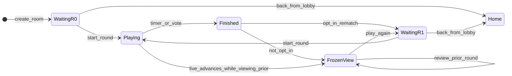

# Онлайн-мультиплеєр: узгоджені правила логіки

> Доповнення до [`slovozbyrachy_tz.md`](./slovozbyrachy_tz.md).
> Описує поведінку кімнати, раундів, rematch, присутності та голосувань — узгоджено під час розробки (червень 2026).

## Діаграма станів кімнати



**Opt-in:** лише гравці з «Грати ще» або `online: true` у rematch `waiting` переходять у наступний `playing`. **Non-opt-in** залишаються на замороженому play/results (`FrozenView`), навіть коли RTDB уже `waiting`/`playing` наступного раунду.

---

## 1. Участь у раунді (opt-in)

| Правило                          | Деталі                                                                                                                                                                                                                                                                                                                                                                                                          |
| -------------------------------- | --------------------------------------------------------------------------------------------------------------------------------------------------------------------------------------------------------------------------------------------------------------------------------------------------------------------------------------------------------------------------------------------------------------- |
| **Rematch лише за згодою**       | Наступний раунд у тій самій кімнаті починається лише для гравців, які явно натиснули **«Грати ще»** на екрані результатів (або приєднались до `waiting` після цього).                                                                                                                                                                                                                                           |
| **Хто вважається opt-in**        | Гравець, який ініціював rematch (`actorUid`), або той, у кого в `resultsExitedBy[uid] === true` до переходу `finished → waiting`.                                                                                                                                                                                                                                                                               |
| **Після rematch**                | `resultsExitedBy` стає **durable opt-in latch** (актор rematch + попередні exits), доки `startGameSession` не скине його. Opt-in учасники мають `online: true`; інші — `online: false`, `hasLeft: false` (залишаються в roster для історії, але **не в лобі**). Той самий presence-контракт для live `finished → waiting` **і** archive bootstrap (`buildRematchWaitingSession` + `rematchWaitingPlayerPatch`). |
| **Перегляд попереднього раунду** | Гравець, який **не** натиснув «Грати ще», залишається на **замороженому** ігровому екрані або результатах **свого** раунду. RTDB може вже показувати `waiting` / `playing` наступного раунду — UI **не** перемикає його автоматично.                                                                                                                                                                            |
| **Локальний знімок**             | Слова та стан завершеного раунду на play-екрані **заморожуються локально**; очищення RTDB при rematch не повинно спустошувати UI у гравця, що лишився на попередньому раунді.                                                                                                                                                                                                                                   |

---

## 2. Навігація та вихід

| Правило                       | Деталі                                                                                                                                                                                                                                                                                                                                                                                                                                                                                                                                                                       |
| ----------------------------- | ---------------------------------------------------------------------------------------------------------------------------------------------------------------------------------------------------------------------------------------------------------------------------------------------------------------------------------------------------------------------------------------------------------------------------------------------------------------------------------------------------------------------------------------------------------------------------- |
| **«Назад» з лобі**            | **Усі** гравці (організатор, обирач слова, звичайний учасник) йдуть на **головний екран** через `exitOnlineToHome`.                                                                                                                                                                                                                                                                                                                                                                                                                                                          |
| **Налаштування гри**          | Окремий шлях: кнопка **«Налаштувати гру»** (перший раунд без базового слова), **не** кнопка «Назад».                                                                                                                                                                                                                                                                                                                                                                                                                                                                         |
| **Організатор і кімната**     | Організатор може піти з `waiting`; кімната **залишається**, якщо є інші гравці, які можуть продовжити (rematch / picker). Видалення — лише коли ніхто не може продовжити (`shouldOrganizerAbandonWaitingRoom`).                                                                                                                                                                                                                                                                                                                                                              |
| **Play → lobby**              | Якщо play відкрито при `status === 'waiting'` і гравець **не** на замороженому попередньому раунді — редірект на лобі. Non-opt-in у rematch waiting — редірект на frozen results (`useLiveRoundLobbyScreen`).                                                                                                                                                                                                                                                                                                                                                                |
| **Setup → lobby**             | Організатор на `setup?from=lobby`: коли раунд уже `playing`, редірект у лобі (далі auto-join у гру за правилами opt-in).                                                                                                                                                                                                                                                                                                                                                                                                                                                     |
| **«Грати ще» (results)**      | Після дії — **свіжий** read RTDB (`optIntoLiveRound`): відсутній root або `finished` → rematch/bootstrap з архіву; маршрут за `resolvePostJoinRoute`. `finished → waiting` — **транзакція** (аборт, якщо вже `waiting`); другий rematcher **лише join** (latch + cleanup), без rewrite `players`/picker/слова. Для вже відкритого rematch `waiting` presence (`rejoin` / online) іде **у фоні** — не блокує вихід з results. Для live `playing` presence **чекаємо** (потрібен `liveRoundPlayerUids`). Лобі не кидає opted-in назад на results при короткому `online:false`. |
| **QR/code join → play**       | Під час live `playing`: `rejoinExistingPlayer` атомарно (player online + `liveRoundPlayerUids`); `resolvePostJoinRoute` → play для `isLiveParticipant` (включно з briefly offline на round 2+). Results з join (`fromJoin=1`) **не** гідратять prior-archive, поки live `playing`.                                                                                                                                                                                                                                                                                           |
| **Play → results**            | Local time-up **пінить** round; rematch не adopt-ить новий round і **не** крутить expire/finish на N+1. Ensure з pinned expected; перед `replace` — archive ready (live finished write або local seed/check). Немає архіву → error у модалці + retry. Empty roster на results не тримає words-bootstrap spinner.                                                                                                                                                                                                                                                             |
| **Presence на results**       | Якщо `frozenRound < liveRound` — **`markPlayerOffline`** (перегляд попереднього раунду, навіть коли live уже `playing`). Якщо frozen = live finished — offline для перегляду без live-присутності в наступному раунді.                                                                                                                                                                                                                                                                                                                                                       |
| **Play → play (новий раунд)** | Автоперехід / `rejoinExistingPlayer` — **лише** якщо гравець **активний учасник поточного `playing`** раунду, а не переглядає попередній (`isReviewingPriorRoundOnPlayScreen`).                                                                                                                                                                                                                                                                                                                                                                                              |
| **Left → results**            | «Переглянути результати» лишається після завершення раунду, навіть коли інший гравець уже відкрив rematch (`waiting` / `playing` наступного раунду); маршрут і **вміст** екрана прив’язані до `leftAtBaseWordRound`, не до «останнього» локального архіву.                                                                                                                                                                                                                                                                                                                   |

---

## 3. Лобі rematch (раунд 2+)

| Правило                  | Деталі                                                                                                                                                                                                                                                                                                                                                                                                                                                                                                                                                  |
| ------------------------ | ------------------------------------------------------------------------------------------------------------------------------------------------------------------------------------------------------------------------------------------------------------------------------------------------------------------------------------------------------------------------------------------------------------------------------------------------------------------------------------------------------------------------------------------------------- |
| **Видимість у списку**   | У `waiting` з `baseWordRound > 0` показуються opted-in: `online: true`, `resultsExitedBy[uid]` latch, **`baseWordPickerUid`** (місце обирача до/під час pick-word), **або** `baseWordChosenBy` з уже обраним словом. `hasLeft === true` **без** durable latch/pickerUid/слова — **не** показувати (навіть якщо `online` воскрес). Stale `hasLeft` **з** durable rematch-сигналом лишає піра видимим — інакше пізній joiner бачить «Гравці (1)» і краде pick. Локальний `rematchOptInLatched` тримає _себе_ в лобі, але **не** робить видимим для пірів. |
| **Лічильник гравців**    | Відповідає видимому списку, не всьому roster.                                                                                                                                                                                                                                                                                                                                                                                                                                                                                                           |
| **Старт раунду**         | `startGameSession` скидає `score`/`wordCount` через leaf-патчі: у лобі (`online: true`) / offline opt-in (`resultsExitedBy`) — повний reset + `hasLeft: false` для актора; peers’ `online` клієнт **не** перезаписує (RTDB rules). `liveRoundPlayerUids` = online **або** rematch latch / chosenBy (`waitingLobbyOptInUids`), завжди з актором старту — lock екрана не викидає opted-in з раунду.                                                                                                                                                       |
| **Auto-join з лобі**     | Late join у вже стартований раунд — лише для **opted-in** (`online` / `resultsExitedBy` / latch), не для організатора «за посадою».                                                                                                                                                                                                                                                                                                                                                                                                                     |
| **Mid-round join patch** | Після `players/{uid}` — `liveRoundPlayerUids` append + auto x2 latch; рекомпут score лише leaf-ами `players/{uid}/score\|wordCount` (не rewrite всього `players` — інакше rules на `online` peers валить атомарний update і стартер лишається «соло»).                                                                                                                                                                                                                                                                                                  |

---

## 4. Обирач базового слова

| Правило                             | Деталі                                                                                                                                                                                                                                                                                                                                                                                                                            |
| ----------------------------------- | --------------------------------------------------------------------------------------------------------------------------------------------------------------------------------------------------------------------------------------------------------------------------------------------------------------------------------------------------------------------------------------------------------------------------------- |
| **Черга**                           | Стабільний порядок **першого входу в кімнату** (`baseWordPickerOrder` / `joinedAt`), **не** порядок «Грати ще».                                                                                                                                                                                                                                                                                                                   |
| **Раунд 1 (`baseWordRound === 0`)** | Перший у черзі = організатор / перший eligible у `baseWordPickerOrder`.                                                                                                                                                                                                                                                                                                                                                           |
| **Раунд 2+**                        | Хід іде наступним у черзі кімнати. Хто **не** opted-in у цей раунд — пропускається; слот у того, хто вже приєднався. При кожному новому opted-in у лобі пікер **перераховується**. Приклад: A→B→C, черга B; зайшли A і C, B немає → пікер **C** (A обирав минулий раунд).                                                                                                                                                         |
| **Перший у новому раунді**          | Поки ніхто інший не приєднався — перший rematcher **може** обрати слово і стартувати. Немає «seat hold» на гравця, який ще на results/play.                                                                                                                                                                                                                                                                                       |
| **Пізній join законного обирача**   | Якщо гравець, за ким черга за ротацією, заходить у rematch лобі **не першим**, але **до старту** — він отримує право **змінити** базове слово і стартувати. Після `waiting → playing` слово вже не міняють; пізній join лише в live-гру.                                                                                                                                                                                          |
| **Слово законного обирача**         | Якщо `baseWordChosenBy` досі є rightful за ротацією серед opted-in — слово **не** очищається і слот **не** крадеться, навіть коли обирач коротко `online: false` (AppState `inactive` / фокус іншого симулятора). Очищення — лише коли з’являється інший rightful opted-in (наприклад раунд 2: перший rematcher → другий заходить).                                                                                               |
| **Eligible**                        | `online === true`, `hasLeft !== true`. У rematch waiting також: `resultsExitedBy` latch, **`baseWordPickerUid`**, **або** `baseWordChosenBy` з уже обраним словом — ці durable сигнали **переживають** короткий `online: false` і stale `hasLeft`. Офлайн roster без latch / pickerUid / committed word **не** в ротації. Presence `online: true` **не** викликає `reconcileLobbyPickerState` (очищення слова лише з lobby sync). |
| **RTDB**                            | `baseWordPickerUid` синхронізується з `currentBaseWordPickerUid()` (`syncLobbyPickerState`). Слово чужого (вже не rightful) picker очищається через `shouldClearLobbyBaseWordForPicker`. Lobby → pick-word: **`push` + `fromLobby`**. Rematch latch: актор пише лише `resultsExitedBy/{self}` (rules).                                                                                                                            |
| **Старт гри**                       | Стартувати може **поточний обирач** (`canActorStartWaitingRound`), не лише організатор. Базове слово в setup/pick-word пише **лише** поточний picker.                                                                                                                                                                                                                                                                             |

---

## 5. Активний учасник live-раунду

```text
isActiveLivePlayer(session, uid) :=
  session.status === 'playing'
  AND players[uid] існує
  AND players[uid].online === true
  AND NOT (players[uid].hasLeft === true AND players[uid].online !== true)
  AND (baseWordRound === 0 OR uid ∈ session.liveRoundPlayerUids)
```

**Stale `hasLeft`:** якщо `online === true`, гравець вважається active навіть коли `hasLeft` не встиг скинутись після rejoin. Справжній вихід — `hasLeft === true` **і** `online === false`.

**`liveRoundPlayerUids`:** при старті `waiting → playing` — uids з `online: true` у лобі; при mid-round rejoin (`rejoinExistingPlayer`) uid додається. Для `baseWordRound > 0` порожній/`null` список означає «ніхто не в раунді» (strict, без fallback). Гравець на results попереднього раунду **не** в списку → не active, не голосує.

| Використання                                   |                                                                      |
| ---------------------------------------------- | -------------------------------------------------------------------- |
| Маршрутизація play / lobby / results           | Так                                                                  |
| Голосування (завершити / пауза / час / resume) | **Обов'язково** — голосують лише active учасники поточного `playing` |
| `rejoinExistingPlayer` на play-екрані          | **Заборонено**, якщо гравець переглядає попередній раунд             |

Гравець на екрані раунду N з `live.baseWordRound > N` після rematch **не** повинен викликати `markPlayerOnline` / `rejoinExistingPlayer` для раунду N+1.

---

## 6. Голосування під час `playing`

| Тип                   | Хто повинен голосувати                                                       |
| --------------------- | ---------------------------------------------------------------------------- |
| Дострокове завершення | Усі **active** суперники (не proposer), `online === true` у поточному раунді |
| Пауза                 | Те саме                                                                      |
| Додатковий час        | Те саме                                                                      |
| Resume після паузи    | Те саме                                                                      |

| Тип                                                          | Хто **не** голосує                                                                                                             |
| ------------------------------------------------------------ | ------------------------------------------------------------------------------------------------------------------------------ |
| Proposer                                                     | Автоматично «за»                                                                                                               |
| Справжній вихід (`hasLeft === true` **і** `online !== true`) | Не в раунді                                                                                                                    |
| `online === false`                                           | Не в поточному live-раунді (переглядає минулий раунд, не натиснув «Грати ще», вийшов, **або згорнув додаток / вимкнув екран**) |
| Гравець з минулого раунду на замороженому play/results       | Навіть якщо в roster                                                                                                           |

**Таймаут голосування (30 с, `EARLY_FINISH_VOTE_TIMEOUT_MS`):**

| Тип          | Якщо жоден required не відхилив до дедлайну                        |
| ------------ | ------------------------------------------------------------------ |
| Early finish | Раунд **завершується**                                             |
| Resume       | Пауза **знімається**                                               |
| Pause        | Пауза **активується** (silence = yes)                              |
| Add-time     | Vote **скидається** (час **не** додається); далі finish-if-expired |

**Соло в раунді** (`!hasOnlineOpponent`): немає жодного суперника з `online === true` (усі вийшли **або** «не в грі» / background). Тоді меню й дії як у одного гравця: «Пауза» / завершити / «Додати» час без голосування — так само, як коли останній суперник натиснув «Вийти».

**Presence → reconcile vote:** коли required voter стає `online: false` (background або leave), клієнти викликають `reconcileOpenSessionVotes` — відкритий vote застосовується, якщо required-множина порожня або всі «так» (pause / early-finish / add-time / resume). Pause також резолвиться по 30s expiry interval (`resolvePauseVoteIfReady`).

**Resume UI на паузі:** `PauseRoundModal` — in-tree overlay (не RN `Modal`), щоб `resumeVote`, що приходить уже під час відкритої паузи, одразу малював Так/Ні. Play-екран також робить one-shot `tryReadGameSessionSnapshot` на AppState `active`, якщо listener пропустив оновлення (два симулятори / inactive).

**Expire vs stale local clock:** якщо локальний `timerEndsAt` уже минув, але `finishGameSessionIfExpired` не комітить (у RTDB ще є час або активна пауза — типово після missed updates / фону), клієнт **не** форсить local round-over: спочатку `tryRead` + heal (`isRemoteRoundClockStillRunning`). Інакше один гравець іде в results, поки peer ще грає.

**Додатковий час — локальний пікер vs голосування:** локальна `AddTimeModal` (вибір хвилин до `proposeAddTime`) дефермить finish **лише на цьому клієнті** (пікер лишається відкритим до settle `proposeAddTime`). Стійкий defer між пристроями — лише RTDB `addTimeVote` (`finishGameSessionIfExpired` не комітить, поки vote живий). Поки пікер відкритий без vote, інший клієнт усе ще може завершити раунд по таймеру. Якщо propose no-op (раунд уже `finished`) або пікер закрито після `00:00` без vote — клієнт показує «Гру завершено» (`resolveAddTimePickerDismissAction` / `shouldShowTimeUpModal`), без зависання play UI.

---

## 7. Присутність (`online`)

**UI-статуси гравця (три видимі):**

| Підпис       | Умова RTDB                             |
| ------------ | -------------------------------------- |
| **в грі**    | `online === true`                      |
| **не в грі** | `online !== true` і `hasLeft !== true` |
| **вийшов**   | `hasLeft === true` і `online !== true` |

| Правило                                | Деталі                                                                                                                                                                                                                                                                                                                                                                                                                                                                                                                                                     |
| -------------------------------------- | ---------------------------------------------------------------------------------------------------------------------------------------------------------------------------------------------------------------------------------------------------------------------------------------------------------------------------------------------------------------------------------------------------------------------------------------------------------------------------------------------------------------------------------------------------------- |
| **AppState `background` / `inactive`** | **Play / live:** `inactive` + `background` → `markPlayerOffline` (iOS lock часто лишається на `inactive`). **Lobby screen (будь-який `status`, поки екран змонтований):** лише `background` → offline (`lobbyPresenceOfflinePolicy` → `background-only`) — не перемикати на play-політику при `waiting → playing` (інакше remount presence без handoff пише false offline → «rejoined was offline» одразу після старту). Тренувальний auto-pause лишається лише на `background`. `markPlayerOffline` пише `online: false` **перед** `onDisconnect.cancel`. |
| **AppState `active`**                  | `markPlayerOnline` — статус знову «в грі».                                                                                                                                                                                                                                                                                                                                                                                                                                                                                                                 |
| **RTDB reconnect**                     | `.info/connected` → `markPlayerOnline` **лише** коли `AppState.currentState === 'active'` (reconnect у фоні не воскрешає online).                                                                                                                                                                                                                                                                                                                                                                                                                          |
| **Auto-rejoin vs background**          | `shouldRejoin` (`online:false` без `hasLeft`) **не** викликає `reconcilePlayerPresence` / `markPlayerOnline`, поки AppState не `active` — інакше leave→rejoin→background знову ставить «в грі».                                                                                                                                                                                                                                                                                                                                                            |
| **Після `finished`**                   | Play-екран викликає `markPlayerOffline` для перегляду результатів без live-присутності в наступному раунді.                                                                                                                                                                                                                                                                                                                                                                                                                                                |
| **Results + live `playing`**           | Якщо `frozenRound < liveRound` — **`markPlayerOffline`** (перегляд попереднього раунду, не в live). Якщо frozen = live — offline не ставиться.                                                                                                                                                                                                                                                                                                                                                                                                             |
| **Відправка слова**                    | Транзакції score/wordCount **не** змінюють `online` / `hasLeft` (presence окремо через rejoin / presence hook).                                                                                                                                                                                                                                                                                                                                                                                                                                            |
| **Toast `player_joined`**              | Лише коли гравець стає **active** у live-раунді (`online` + `liveRoundPlayerUids`). Зміна `hasLeft`/roster без opt-in — без toast.                                                                                                                                                                                                                                                                                                                                                                                                                         |
| **Toast offline / returned**           | Offline без `hasLeft` у live-раунді → «не в грі»; повернення `online` у тому ж раунді → «знову в грі». Не плутати з `player_left` / mid-round join. Свідомий «Вийти»: `beginVoluntaryLeave` **до** navigate на left, щоб unmount не писав проміжний `online: false` без `hasLeft`.                                                                                                                                                                                                                                                                         |
| **`alone_in_game`**                    | Не спрацьовує, якщо в той самий diff хтось увійшов у live-раунд. Offline зі score без `liveRoundPlayerUids` не рахується учасником. **Не** на чистому background-offline.                                                                                                                                                                                                                                                                                                                                                                                  |
| **Новий `playing`**                    | `usePlayerOnlinePresence` увімкнено для учасника live-roster (`isInLiveRound`, не `hasLeft`, не reviewing prior) — включно з briefly offline, щоб rejoin спрацював.                                                                                                                                                                                                                                                                                                                                                                                        |
| **Вимкнення presence**                 | Unmount без `handoffPlayerPresence` → `voluntaryLeaveWaitingLobbyIfMember` (waiting non-org → leave; інакше `markPlayerOffline`). Handoff між екранами однієї кімнати **не** ставить offline. Explicit offline — `exitOnlineToHome` / `leaveGameSession` / `markPlayerOffline`.                                                                                                                                                                                                                                                                            |
| **Перегляд старішого раунду**          | На play при `liveRound > frozenRound` — `markPlayerOffline` навіть коли RTDB уже `playing`; на results — те саме.                                                                                                                                                                                                                                                                                                                                                                                                                                          |

---

## 8. Результати та архів

| Правило                         | Деталі                                                                                                                                                                                                                                                                              |
| ------------------------------- | ----------------------------------------------------------------------------------------------------------------------------------------------------------------------------------------------------------------------------------------------------------------------------------- |
| **Заморожений раунд**           | `shouldKeepFrozenResultsOverLiveFinished` — не підміняти UI, якщо live вже на новішому `baseWordRound`.                                                                                                                                                                             |
| **Відновлення з архіву**        | `shouldRecoverFinishedRoundFromArchive` — коли live `waiting` / `playing`, а гравець дивиться старі результати. **Виняток:** join/rejoin з `fromJoin=1` під час live `playing` — prior-archive **не** гідратиться (уникає чужого лексикону; UI може бути порожнім до кінця раунду). |
| **Спільні слова на early exit** | Не приховувати співавторів на results — вони вже видимі на play-екрані (`mask-results-for-viewer`).                                                                                                                                                                                 |

---

## 9. Помилки замість зависання

| Ситуація                         | Очікувана поведінка                                      |
| -------------------------------- | -------------------------------------------------------- |
| Late join у lobby не вдався      | Повідомлення `errorJoinFailed`                           |
| Play без session / rejoin failed | Текст помилки + кнопка «Головна», не нескінченний спінер |
| Старт раунду без слова           | `errorBaseWordMissing` / `errorStartFailed`              |

---

## 10. Firebase / правила

| Правило                          | Деталі                                                                                                                                                                         |
| -------------------------------- | ------------------------------------------------------------------------------------------------------------------------------------------------------------------------------ |
| **Старт раунду**                 | RTDB: `baseWordPickerUid` має збігатися з клієнтським `currentBaseWordPickerUid()`. `liveRoundPlayerUids` — хто в live-раунді.                                                 |
| **Rematch `finished → waiting`** | Оновлення гравців через `rematchWaitingPlayerPatch`; non-opt-in не отримують `online: true`. Archive bootstrap (`buildRematchWaitingSession(actorUid)`) — **той самий** patch. |
| **Orphan shell**                 | Читання для гравця з roster, якщо сесію видалено частково.                                                                                                                     |

---

## 11. Матриця екранів (коротко)

```text
                    │ waiting (r0) │ waiting (r1+) │ playing (my round) │ playing (other round) │ finished (my view)
────────────────────┼──────────────┼───────────────┼────────────────────┼───────────────────────┼───────────────────
Opt-in rematch      │ lobby/setup  │ lobby         │ play               │ frozen play/results   │ results → Play again
Not opt-in          │ lobby/join   │ NOT in lobby  │ frozen play        │ frozen play/results   │ results (frozen)
Back from lobby     │ home (all)   │ home (all)    │ —                  │ —                     │ —
```

---

## 12. Ключові модулі (код)

### Єдине джерело membership

| Модуль                                                                                 | Відповідальність                                                   |
| -------------------------------------------------------------------------------------- | ------------------------------------------------------------------ |
| [`presence/live-round-membership.ts`](../lib/online/presence/live-round-membership.ts) | `isInLiveRound`, `isActiveLivePlayer`, `isLiveParticipant`, opt-in |

| Питання                         | Функція                                           |
| ------------------------------- | ------------------------------------------------- |
| Хто голосує / presence на play? | `isActiveLivePlayer`                              |
| Standings / opponents?          | `isLiveParticipant`                               |
| Rejoin?                         | `isLiveParticipant` + `live-round-screen-actions` |
| Rematch-лобі?                   | `waitingLobbyOptInUids` / `player.online`         |

### Екрани

| Модуль                                                                           | Відповідальність                      |
| -------------------------------------------------------------------------------- | ------------------------------------- |
| [`live-round-screen-actions.ts`](../lib/online/live-round-screen-actions.ts)     | Play / lobby / results guards         |
| [`session/frozen-round-view.ts`](../lib/online/session/frozen-round-view.ts)     | Заморожений перегляд старіших раундів |
| [`rematch/opt-into-live-round.ts`](../lib/online/rematch/opt-into-live-round.ts) | «Грати ще»                            |
| [`useLiveRoundPlayScreen`](../hooks/useLiveRoundPlayScreen.ts)                   | Play effects                          |
| [`useLiveRoundLobbyScreen`](../hooks/useLiveRoundLobbyScreen.ts)                 | Lobby auto-join + non-opt-in redirect |

### Інше

| Модуль                                                    | Відповідальність |
| --------------------------------------------------------- | ---------------- |
| `base-word-picker.ts`, `players-patch-for-round-start.ts` | Раунд / обирач   |
| `voting/early-finish-vote.ts` (+ pause/add-time/resume)   | Голосування      |
| `exit-online-flow.ts`                                     | Вихід на головну |

---

_При зміні поведінки оновлюйте цей файл разом із `docs/firebase_schema.md` та мокапами за правилами проєкту._
